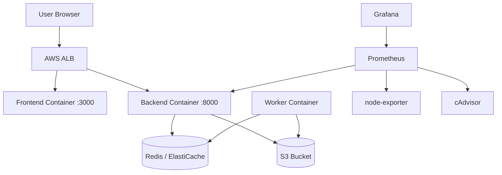
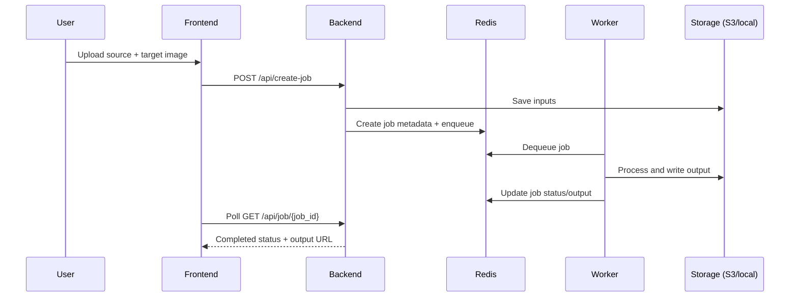

# AI Face Swap Platform

Single repo for application + infrastructure.

## What This Project Does

This project runs an AI face-swap application with:
- Next.js frontend
- FastAPI backend
- Redis-based async worker processing
- Dockerized runtime (local + EC2)
- OpenTofu-managed AWS infrastructure
- GitHub Actions CI/CD deployment via AWS SSM
- Prometheus + Grafana monitoring

## Project Layout

```text
repo-clean/
  app/
    backend/                  # FastAPI API + worker code
    frontend/                 # Next.js UI
    monitoring/               # Prometheus + Grafana configs/dashboards
    docker-compose.yml        # Local dev stack
    docker-compose.aws.yml    # EC2 runtime stack
    deploy-ec2-single.sh      # Runtime deploy script used on EC2
  infra/
    main.tf                   # AWS resources
    variables.tf              # Inputs
    output.tf                 # Outputs/ops commands
    templates/app_user_data.sh.tftpl
```

## Architecture

### High-Level Architecture



### End-to-End Request Flow

1. User hits ALB (or Cloudflare tunnel URL).
2. Frontend serves UI and calls `/api/*`.
3. ALB routes `/api/*` to backend service.
4. Backend stores job + enqueues work in Redis.
5. Worker pulls jobs from Redis, runs face swap, writes output to S3.
6. Backend serves job status and output URLs to frontend.
7. Prometheus scrapes backend + node-exporter + cAdvisor; Grafana visualizes metrics.



## Day-to-Day Commands

### Infrastructure

```bash
cd infra
tofu init
tofu plan
tofu apply
```

### Local App

```bash
cd app
docker compose up --build
```

### EC2 Redeploy (after infra/app changes)

```bash
sudo bash /opt/scripts/deploy-ec2-single.sh
```

## Monitoring URLs

- Grafana (via ALB): `http://<alb-dns>/grafana`
- Prometheus (via ALB): `http://<alb-dns>/prometheus`

## Notes

- Use supported upload formats: `.jpg`, `.jpeg`, `.png`, `.webp`.
- Runtime env is generated at `/opt/ai-face-swap/.env.runtime` by infra user-data.

For full architecture, request flow, deployment, and file-by-file explanation, see [DOCUMENTATION.md](./DOCUMENTATION.md).
For full incident history and fixes, see [PROJECT_TROUBLESHOOTING_PLAYBOOK.md](./PROJECT_TROUBLESHOOTING_PLAYBOOK.md).
